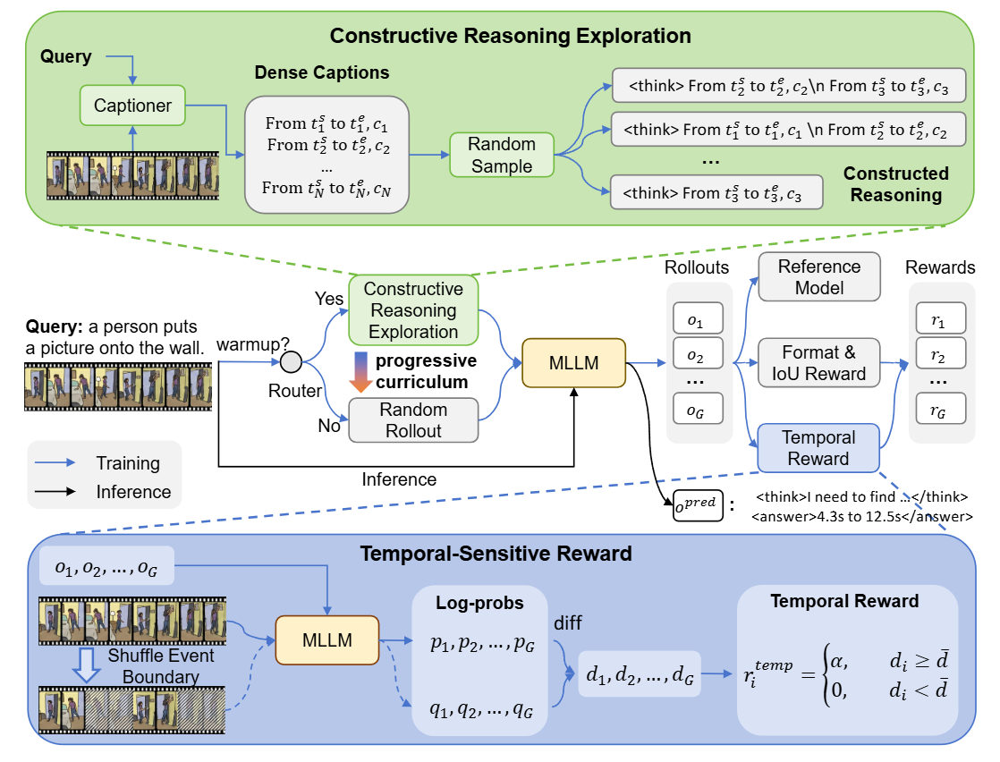

# TaRO: Temporal-Aware Reasoning Optimization for Video Temporal Grounding

**Coming Soon.**

Multi-modal Large Language Models (MLLMs) have achieved remarkable progress in video temporal grounding (VTG) with the introduction of reinforcement learning (RL) for generating reasoning paths. However, existing models often produce superficial reasoning, such as providing generic video descriptions, which offer limited guidance for precise temporal localization. This limitation stems from (1) inefficient random exploration in RL, and (2) reward functions that focus solely on the answer correctness while ignoring reasoning quality. To address these issues, we propose TaRO (Temporal-Aware Reasoning Optimization), a framework that explicitly enhances the model’s ability of thinking with time. First, we introduce a Constructive Reasoning Exploration that leverages pre-generated dense captions to construct reasoning paths grounded in explicit visual cues and timestamps, enabling efficient exploration of high-quality time-aware reasoning. Second, to evaluate reasoning quality, we design a Temporal-Sensitivity Reward. We postulate that high-quality reasoning should be anchored to specific events and timestamps. If the event boundary under thinking is disrupted (e.g., via frame shuffling), such reasoning should become invalid, leading to a drop in the logit of the reasoning path. We utilize this drop as a critique of reasoning quality. Finally, TaRO follows a progressive curriculum, which starts by utilizing this reward to select better constructed reasoning paths, and evolves to a free exploration phase where the model autonomously generates effective reasoning. Extensive experiments demonstrate that TaRO improves temporal reasoning and achieves state-of-the-art performance on VTG benchmarks.

