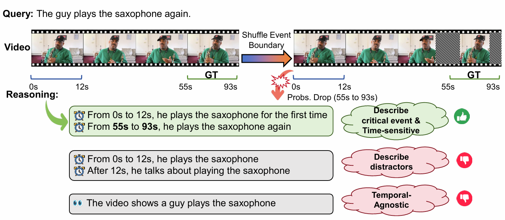

# Temporal-Aware Reasoning Optimization for Video Temporal Grounding

<div align="center">

[](https://arxiv.org/abs/2606.09248)
[](https://huggingface.co/zhengmh/TaRO-8B)
[](https://huggingface.co/zhengmh/TaRO-7B)
[](https://huggingface.co/zhengmh/TaRO-3B)
[](https://minghangz.github.io/publication/taro/)

**[ICML 2026]** Official PyTorch Implementation for TaRO.



</div>

## ✨ Introduction

This paper introduces **TaRO (Temporal-Aware Reasoning Optimization)**, a novel framework designed to enhance the reasoning capabilities of Multi-modal Large Language Models (MLLMs) for Video Temporal Grounding (VTG). Existing reinforcement learning models often produce superficial reasoning because they rely on inefficient random exploration and reward functions that only evaluate the correctness of the final answer. 

To solve this, TaRO explicitly encourages the model to "think with time" using three main components:

- **Constructive Reasoning Exploration**: Leverages pre-generated dense captions to build high-quality reasoning paths grounded in explicit visual cues and timestamps, guiding the model's initial learning.

- **Temporal-Sensitivity Reward**: Evaluates the quality of the model's reasoning by shuffling video frames near ground-truth boundaries; if the reasoning is genuinely anchored to specific events, the model's confidence will appropriately drop when the temporal order is disrupted.

- **Progressive Curriculum**: Smoothly transitions the model from supervised imitation of the constructed reasoning paths to autonomous self-exploration.

Through these methods, TaRO ensures reasoning is strictly anchored to critical visual-temporal evidence, achieving state-of-the-art zero-shot performance across multiple VTG benchmarks.

---

## 📑 Table of Contents

- [Installation](#-installation)
- [Quick Start](#-quick-start)
- [Evaluation](#-evaluation)
- [Training](#-training)
- [Citation](#-citation)

---

## 🛠️ Installation

Create a conda environment and install the required dependencies:

```bash
conda create -n TaRO python=3.11 -y
conda activate TaRO

# Install PyTorch
pip install torch==2.7.1 torchvision==0.22.1

# Install other dependencies
pip install -r requirements.txt
```

---

## 🚀 Quick Start

First, download the pretrained models from [Hugging Face](https://huggingface.co/collections/zhengmh/taro).

| Model | Base Model | Checkpoint | 
|  ---  |    ----    |    ----    |
| TaRO-8B | Qwen3-VL-8B-Instruct   | [link](https://huggingface.co/zhengmh/TaRO-8B) | 
| TaRO-7B | Qwen2.5-VL-7B-Instruct | [link](https://huggingface.co/zhengmh/TaRO-7B) | 
| TaRO-3B | Qwen2.5-VL-3B-Instruct | [link](https://huggingface.co/zhengmh/TaRO-3B) | 

Then, Launch the interactive demo by running:

```bash
python demo.py --model /path/to/model
```

---

## 📊 Evaluation

### 1. Download Evaluation Datasets

Download the videos for the respective evaluation datasets using the links below:

| Dataset | Download Link |
| --- | --- |
| **Charades-STA** | [Download](https://ai2-public-datasets.s3-us-west-2.amazonaws.com/charades/Charades_v1.zip) |
| **ActivityNet Captions** | [Download](http://activity-net.org/download.html) |
| **QVHighlights** | [Download](https://nlp.cs.unc.edu/data/jielei/qvh/qvhilights_videos.tar.gz) |
| **TVGBench** | [Download](https://huggingface.co/datasets/Boshenxx/TimeR1-Dataset) |

After downloading, configure the video paths and annotation files in `standalone_eval/dataset_config.py`.

### 2. Run Evaluation

Run the evaluation script by specifying the model path and the target dataset:

```bash
cd standalone_eval
python evaluate_vtg.py --model_path /path/to/model --dataset DATASET_NAME
```

> **Note:** `DATASET_NAME` can be one of the following: `Charades`, `Activitynet`, `QVHighlights`, or `TVGBench`.

---

## 🚂 Training

### Data Preparation

Download the **[TimeR1 Dataset](https://huggingface.co/datasets/Boshenxx/TimeR1-Dataset)** and place it in `data/TimeR1-Dataset`.

### Start Training

```bash
# Qwen2.5-VL-7B-Instruct
bash scripts/run_qwen2_5_vl_7b.sh

# Qwen2.5-VL-3B-Instruct
bash scripts/run_qwen2_5_vl_3b.sh

# Qwen3-VL-8B-Instruct
bash scripts/run_qwen3_vl_8b.sh
```

Convert and merge the final model weights using the best checkpoint (selected based on validation performance):

```bash
python -m verl.model_merger merge \
    --backend fsdp \
    --local_dir outputs/<exp_id>/checkpoints/global_step_<xxx>/actor \
    --target_dir /path/to/merged_final_model
```

> *Replace `<exp_id>` with actual path and `global_step_<xxx>` with the actual step number of your best checkpoint.*

Replace the merged model's `config.json` (`/path/to/merged_final_model/config.json`) with the `config.json` from [Qwen2.5‑VL‑7B‑Instruct](https://huggingface.co/Qwen/Qwen2.5-VL-7B-Instruct/blob/main/config.json), [Qwen2.5‑VL‑3B‑Instruct](https://huggingface.co/Qwen/Qwen2.5-VL-3B-Instruct/blob/main/config.json), or [Qwen3‑VL‑8B‑Instruct](https://huggingface.co/Qwen/Qwen3-VL-8B-Instruct/blob/main/config.json); otherwise vLLM inference may encounter problems.

---

## 🤝 Acknowledgements

We thank the following projects: [time-r1](https://github.com/xiaomi-research/time-r1), [verl](https://github.com/verl-project/verl), [vLLM](https://github.com/vllm-project/vllm)

---

## 📖 Citation

If you find our work helpful for your research, please consider citing our paper:

```bibtex
@InProceedings{Zheng_2026_ICML,
    author    = {Zheng, Minghang and Yin, Zihao and Yang, Yi and Peng, Yuxin and Liu, Yang},
    title     = {Temporal-Aware Reasoning Optimization for Video Temporal Grounding},
    booktitle = {International Conference on Machine Learning},
    year      = {2026}
}
```
